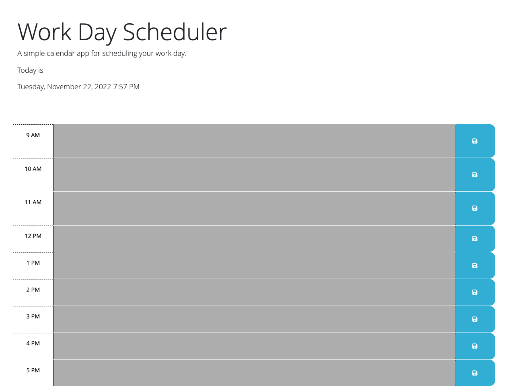

# Workday-Scheduler README

## About
The purpose of this assignment was to use jQuery DOM traversal methods to navigate the DOM of the starter code provided, selecting specific elements and writing functions to apply class styling conditionally based on the user's current time of day (using dayjs to pull the time) and save user input to the selected textareas on clicking the selected save buttons.

Unfortunately, while I (temporarily) got localStorage.setItem and .getItem to kind of work, I couldn't figure out how to define one variable to select each intended textarea element or how to specify to treat each textarea input as separate instead of as one object (i.e., save as separate objects and display in separate textareas). When my code was semi-working, it was saving input in one textarea and displaying it in every textarea. 

## Installation
N/A

## Screenshot
This is what the deployed work-in-progress site looks like with conditional class styling fully functioning (but saving locally not working). This screenshot was taken after 5 PM, so all schedule blocks are styled with a grey background to indicate they are in the past based on the user's local time:

## Deployed Site
To see the deployed site, click [here](https://sar-kat-hop.github.io/Workday-Scheduler/). 

## Contributions
Many different resources from class activities to MDN, StackOverflow, Web3Schools, and jQuery documentation were used in the process of trying to figure this out. I'll be seeking additional support from student tutoring services soon to fix the outstanding issues with local storage and resubmit the assignment.

## License
Please see the license included in the repo.
